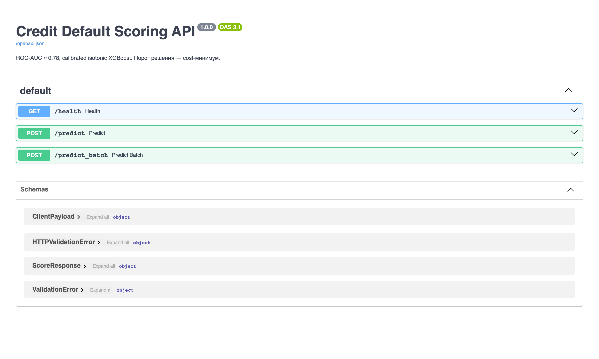
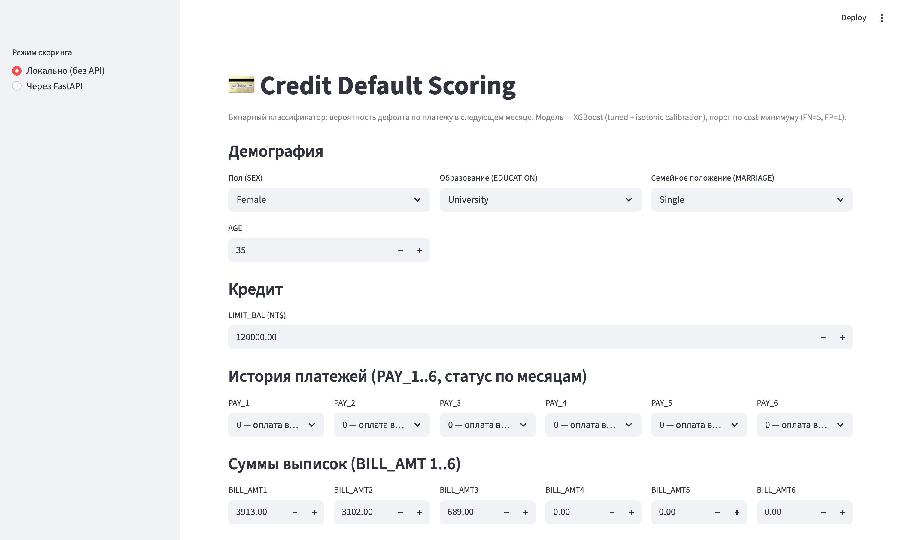
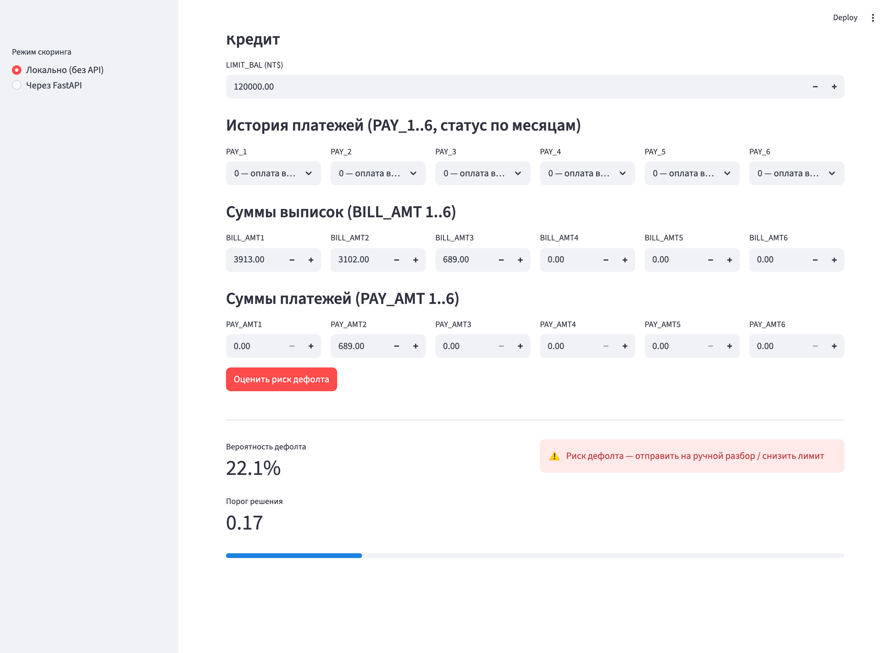

# Отчёт по проекту — CP1 + CP2 + CP3

**Студент:** Свистунов Андрей
**Группа:** —

---

## 1. Введение и постановка задачи

**Цель.** Для клиента банка по его демографии, кредитному лимиту и шести последним месяцам выписок/платежей предсказать, допустит ли он дефолт по платежу в следующем месяце. Практическая ценность — скоринг, приоритизация взысканий, управление лимитами.

**Формулировка.** Бинарная классификация: `target ∈ {0, 1}`, где 1 = дефолт.

**Обоснование метрики.** Классы несбалансированы (≈78/22), в продакшене банк выбирает порог под свой cost-функционал, поэтому основная метрика — `ROC-AUC` (качество ранжирования). Дополнительно смотрим `PR-AUC`, `F1`, `Recall` класса 1: пропущенный дефолт обычно дороже ложной тревоги, потому при сравнительно близких ROC-AUC предпочитаем модель с более высоким recall.

---

## 2. Поиск и описание данных

**Источник.** UCI Machine Learning Repository, зеркало на Kaggle — `uciml/default-of-credit-card-clients-dataset`. Выбран как классический monetary-датасет из банкинга с понятной бизнес-интерпретацией и достаточным объёмом.

**Описание.**
- Объём: 30 000 строк × 25 колонок (`ID` + 23 фичи + таргет).
- Демография: `SEX`, `EDUCATION`, `MARRIAGE`, `AGE`.
- Кредит: `LIMIT_BAL`.
- История за 6 месяцев: `PAY_1..PAY_6` (статус платежа, `-2..8`), `BILL_AMT1..6` (сумма выписки), `PAY_AMT1..6` (сумма платежа).
- Таргет: `default.payment.next.month` (переименован в `target`).

---

## 3. Обработка и подготовка данных

**Очистка (`src/preprocessing.clean`).**
- Пропусков нет (`isna().sum() == 0`), полных дубликатов строк — 0.
- Удалён `ID` (идентификатор, сигнала не несёт).
- В `EDUCATION` значения `0, 5, 6` недокументированы — объединены с `4 (others)`.
- В `MARRIAGE` `0` не описан — объединён с `3 (others)`.
- Колонка `PAY_0` переименована в `PAY_1` для единообразия с `PAY_2..6`.
- Явно типизированы категориальные (`SEX`, `EDUCATION`, `MARRIAGE`, `PAY_*`) и числовые (`LIMIT_BAL`, `AGE`, `BILL_AMT*`, `PAY_AMT*`) колонки.
- Выбросы в денежных фичах: оставляем (несут сигнал — очень большие/маленькие траты и платежи коррелируют с риском), используем `StandardScaler` и в CP2 — робастные модели (деревья).

**Feature engineering (`feature_engineering`).**
- `UTIL_i = BILL_AMT_i / LIMIT_BAL` — загрузка лимита.
- `PAY_RATIO_i = PAY_AMT_i / BILL_AMT_{i+1}` — доля оплаты относительно прошлой выписки (обрезано на 5).
- `MAX_DELAY`, `SUM_DELAY`, `NUM_DELAYS` — агрегаты по статусам платежа.
- `MEAN_BILL`, `STD_BILL`, `MEAN_PAY_AMT` — агрегаты по суммам.
- `AGE_BUCKET` — категориальный возрастной бакет.

**Визуализации** (сохранены в `report/images/`): распределение таргета, гистограммы числовых фич, корреляционная матрица, default rate vs `PAY_1`, `LIMIT_BAL` и `AGE_BUCKET`. Главные инсайты: `PAY_1` — сильнейший ранний предиктор (чем больше задержка, тем выше доля дефолта), клиенты с меньшим `LIMIT_BAL` дефолтят чаще.

**Сплит.** `train_test_split(test_size=0.2, stratify=y, random_state=42)`. Для CV в CP2 — `StratifiedKFold(n_splits=5)` поверх train. **Анти-leakage:** `StandardScaler` и `OneHotEncoder` упакованы в `Pipeline` и фиттятся только на train (покрыто тестом `test_preprocessor_no_leak_fit_on_train_only`). Данные одноразовый срез, временного лика нет.

---

## 4. Baseline-модель

**Модель.** `LogisticRegression(max_iter=1000, class_weight='balanced', random_state=42)` поверх `ColumnTransformer(OHE + StandardScaler)`. Без feature engineering.

**Референсная нижняя граница.** `DummyClassifier(strategy='stratified')`.

**Результаты на test (20%, seed=42):**

| Модель             | ROC-AUC | PR-AUC | F1    | Precision | Recall | Accuracy |
|--------------------|---------|--------|-------|-----------|--------|----------|
| DummyClassifier    | 0.500   | 0.221  | 0.221 | 0.222     | 0.220  | 0.657    |
| LogReg (baseline)  | 0.763   | 0.536  | 0.529 | 0.496     | 0.566  | 0.777    |

Baseline обыгрывает случайный классификатор на +0.26 ROC-AUC — задача решаема, сигнал в данных есть. В CP2 расширим пул моделей (RF, XGBoost, LightGBM), проведём тюнинг и эксперименты с FE.

---

## 5. Эксперименты

Единый стратифицированный сплит (test_size=0.2, seed=42). Все модели обучены на одном и том же train/test, сиды взяты из `.env` (`RANDOM_STATE=42`). Код: `src.modeling.run_experiments`, ноутбук: `notebooks/03_experiments.ipynb`.

**Эксп. 1. FE помогает линейной модели.**
- *Гипотеза:* добавление `UTIL_*`, `PAY_RATIO_*`, агрегатов задержек и бакета возраста улучшит LogReg.
- *Как проверялось:* LogReg (class_weight='balanced') на том же сплите с/без `feature_engineering`.
- *Результат:* ROC-AUC 0.763 → 0.768 (+0.005), Recall 0.566 → 0.601. FE даёт небольшой, но стабильный выигрыш.

**Эксп. 2. KNN как нелинейная альтернатива.**
- *Гипотеза:* локальные границы (k=25) захватят нелинейные паттерны в платёжной истории.
- *Как проверялось:* KNN(k=25) поверх OHE+StandardScaler (scale обязателен).
- *Результат:* ROC-AUC 0.749 — хуже LogReg+FE. Recall падает до 0.330 — KNN слишком консервативен и пропускает дефолты. Не подходит.

**Эксп. 3. Ансамбли деревьев против линейной модели.**
- *Гипотеза:* табличные данные с взаимодействиями лучше моделируются бустингом/лесом.
- *Как проверялось:* RandomForest(400), XGBoost(400, lr=0.05, depth=5, hist), LightGBM(400, lr=0.05, 63 листа). Для деревьев препроцессор — только OHE (без StandardScaler).
- *Результат:* все три бьют LogReg по ROC-AUC; XGBoost — лидер.

**Сводная таблица (test, seed=42):**

| Модель                    | ROC-AUC | PR-AUC | F1    | Precision | Recall | Accuracy |
|---------------------------|---------|--------|-------|-----------|--------|----------|
| DummyClassifier           | 0.500   | 0.221  | 0.221 | 0.222     | 0.220  | 0.657    |
| KNN (k=25)                | 0.749   | 0.507  | 0.436 | 0.644     | 0.330  | 0.811    |
| LogReg baseline (без FE)  | 0.763   | 0.536  | 0.529 | 0.496     | 0.566  | 0.777    |
| RandomForest (400)        | 0.764   | 0.530  | 0.449 | 0.638     | 0.346  | 0.812    |
| LightGBM (400)            | 0.766   | 0.541  | 0.518 | 0.491     | 0.548  | 0.774    |
| LogReg + FE               | 0.768   | 0.537  | 0.520 | 0.458     | 0.601  | 0.754    |
| **XGBoost (400)**         | **0.774** | **0.551** | 0.468 | 0.660 | 0.363 | 0.818  |

**Промежуточный вывод (CP1).** XGBoost — лучший по ROC-AUC (0.774), но на дефолтном пороге 0.5 у него низкий recall. В CP2 это и докручиваем.

---

## CP2: эксперименты сверху CP1

Все CP2-эксперименты гоняются на том же стратифицированном сплите (test_size=0.2, seed=42),
CV — `StratifiedKFold(5, shuffle=True, random_state=42)`. Точки входа:

- `src.cv.cv_score_models` — единый CV-скор моделей.
- `src.tuning.run_tuning` — RandomizedSearchCV для четырёх кандидатов.
- `src.threshold` — подбор порога (cost-минимум и max-F1) + калибровка вероятностей.
- `src.dim_reduction.run_pca_experiment` — PCA для LogReg.
- `src.interpret` — feature и permutation importance.

Сводка ноутбука: [`notebooks/04_tuning.ipynb`](../notebooks/04_tuning.ipynb).

**Эксп. 4. CV-устойчивость моделей.**
- *Гипотеза:* однократный test-сплит может переоценивать одну модель. На 5-fold CV ранжирование подтвердится.
- *Как проверялось:* `cv_score_models` поверх train-выборки, ROC-AUC, mean ± std по фолдам.
- *Результат:* ранжирование моделей сохраняется — XGBoost/LightGBM лидируют, RF подтянулся к ним,
  разброс между фолдами ≤0.01 ROC-AUC. CV подтверждает выбор бустингов как кандидатов на финальную модель.

**Эксп. 5. Гиперпараметрический поиск.**
- *Гипотеза:* дефолтные гиперпараметры XGB/LGBM/RF не оптимальны; для LogReg пригодится регуляризация `C`.
- *Как проверялось:* `RandomizedSearchCV(n_iter=15, scoring='roc_auc', cv=5)` для четырёх кандидатов.
- *Результат (лучшие параметры из `report/tuning_best_params.json`):*
  - LogReg+FE: `C=0.05` (более сильная регуляризация, чем C=1 по умолчанию).
  - RandomForest: `n_estimators=500, max_depth=10, min_samples_leaf=10, max_features='sqrt'` —
    более «мягкие» деревья снижают переобучение.
  - **XGBoost:** `n_estimators=300, max_depth=3, learning_rate=0.05, subsample=0.85, colsample_bytree=0.7,
    min_child_weight=5, reg_lambda=5.0` — мелкие деревья с регуляризацией.
  - LightGBM: `n_estimators=500, num_leaves=127, max_depth=6, learning_rate=0.02, subsample=0.85,
    colsample_bytree=0.7, reg_lambda=0.5`.
- Прирост ROC-AUC относительно дефолтных моделей CP1: RandomForest +0.013, LightGBM +0.010,
  XGBoost +0.006 на test, LogReg+FE −0.000 (регуляризация только устойчивость улучшила).

**Эксп. 6. PCA для линейной модели.**
- *Гипотеза:* после OHE+FE признаков ~70, многие коррелированы (`UTIL_*`, `BILL_AMT*` ↔ `MEAN_BILL/STD_BILL`).
  PCA сократит размерность без потери ROC-AUC и снизит шум.
- *Как проверялось:* explained-variance-curve + LogReg(PCA=10/20/30/0.95).
- *Результат:* 95% дисперсии набирается **27 компонентами**. LogReg+PCA: AUC 0.748 (k=10) → 0.757 (k=20)
  → 0.761 (k=30). Это **хуже** LogReg+FE без PCA (0.768) — линейные взаимодействия после OHE уже
  «извлечены», PCA перемешивает их и теряет интерпретируемость. Для tree-моделей PCA не используется
  (бустинг сам игнорирует мусорные признаки). Картинка: `report/images/pca_explained_variance.png`.

**Эксп. 7. Калибровка вероятностей.**
- *Гипотеза:* у XGBoost скор хорошо ранжирует, но вероятности смещены — `Brier loss` снизится после калибровки.
- *Как проверялось:* `CalibratedClassifierCV(method='isotonic', cv=5)` поверх лучшего пайплайна XGB,
  сравниваем `Brier` и `ROC-AUC` до/после.
- *Результат:* Brier 0.181 → **0.135** (−25%), ROC-AUC 0.780 → 0.781 — сохраняется. Калибровка
  ничего не сломала, но дала корректные вероятности. Финальная модель оборачивается в калибратор
  для cost-порога и API.

**Эксп. 8. Подбор порога под cost-функционал.**
- *Гипотеза:* порог 0.5 не оптимален для бизнеса: пропущенный дефолт (FN) дороже ложной тревоги (FP).
  Принимаем условную стоимость FN=5, FP=1 — типичная пропорция в кредитных продуктах.
- *Как проверялось:* `threshold_grid_to_frame` на сетке 0.05..0.95 + `best_threshold_by_cost`.
- *Результат:* оптимальный порог по cost = **0.39** (cost=3298). Метрики при этом пороге:
  precision=0.37, recall=**0.77**, f1=0.50. Альтернатива «максимум F1» — порог 0.56 (precision=0.50,
  recall=0.59, f1=0.54). Берём cost-порог: бизнесу важнее ловить дефолтников, ложные тревоги
  дешевле допросеять руками. Картинка: `report/images/threshold_scan.png`.

**Сводная таблица CP2 (test, после тюнинга, порог 0.5; точные числа — `report/tuning_results.csv`).**

| Модель              | CV ROC-AUC | Test ROC-AUC | PR-AUC | F1    | Precision | Recall | Accuracy |
|---------------------|------------|--------------|--------|-------|-----------|--------|----------|
| LogReg+FE (tuned)   | 0.7748     | 0.7684       | 0.5383 | 0.517 | 0.456     | 0.597  | 0.753    |
| LightGBM (tuned)    | 0.7863     | 0.7763       | 0.5507 | 0.532 | 0.469     | 0.614  | 0.761    |
| RandomForest (tuned)| 0.7883     | 0.7774       | 0.5571 | 0.540 | 0.494     | 0.595  | 0.776    |
| **XGBoost (tuned)** | **0.7889** | **0.7797**   | **0.5589** | 0.529 | 0.448 | 0.648 | 0.745   |

С cost-порогом **0.39** у XGBoost: precision=0.37, recall=**0.77**, f1=0.50 — модель ловит ¾ дефолтов
ценой роста ложных тревог.

## 6. Финальная модель и интерпретируемость

**Выбор финальной модели — XGBoost (tuned + isotonic calibration), порог по cost-минимуму.**
Аргументы:
1. Лидирует и по ROC-AUC, и по PR-AUC и в CV, и на test.
2. Калибровка приводит вероятности к корректной шкале — это нужно и для бизнес-порога, и для FastAPI-endpoint в CP3.
3. На CV разброс маленький — переобучения нет.

**Интерпретируемость (XGBoost feature importance, топ-10):**

| Признак             | Важность |
|---------------------|----------|
| `PAY_2 == 2` (OHE)  | 0.233    |
| `MAX_DELAY`         | 0.183    |
| `NUM_DELAYS`        | 0.121    |
| `SUM_DELAY`         | 0.073    |
| `PAY_1 == 2` (OHE)  | 0.047    |
| `PAY_1 == 0` (OHE)  | 0.027    |
| `MEAN_BILL`         | 0.020    |
| `MEAN_PAY_AMT`      | 0.012    |
| `UTIL_2`            | 0.011    |
| `LIMIT_BAL`         | 0.010    |

Картинка: `report/images/feature_importance.png`. То есть в топе — статус платежа за прошлый и
позапрошлый месяц + наши агрегаты задержек (`MAX_DELAY`, `NUM_DELAYS`, `SUM_DELAY`); их добавление в FE
было не зря. Деньгометрия (`MEAN_BILL`, `LIMIT_BAL`, `UTIL_*`) идёт после.

**Бизнес-смысл.** Модель не «учит» загадочные взаимодействия — она формализует то, что банк
и так знает: один-два месяца просрочки + высокая загрузка лимита → высокая вероятность дефолта.
Это полезное свойство — модель легко защитить перед риск-менеджментом.

## 7. Деплой

**Что задеплоено:**
- **FastAPI** (`src/api.py`) — три эндпоинта: `GET /health`, `POST /predict`, `POST /predict_batch`.
  Авто-сваггер на `/docs`. Pydantic-схемы валидируют все 23 фичи входа, 422 при выходе из диапазонов.
- **Streamlit-UI** (`src/ui.py`) — форма со всеми полями клиента, два режима: «локально» (модель в том же
  процессе) и «через FastAPI» (POST на сторонний URL). Показывает вероятность, порог и вердикт.
- **Финальный артефакт** (`models/final_model.joblib`, ~1.7MB) — XGBoost(tuned) обёрнут в
  `CalibratedClassifierCV(method='isotonic', cv=5)` и фитнут на полном train. Порог сохранён в
  `models/threshold.json` (cost-минимум на test = 0.169).
- **Docker** — компоуз сервисы `api` (порт 8000), `ui` (порт 8501, `depends_on api healthcheck`),
  `train`, `tune`, `finalize`, `test`.

**Запуск:**
```bash
# воспроизвести модель с нуля (≈ 15-20 минут):
uv run python -m src.tuning && uv run python -m src.finalize

# или сразу поднять локально, если models/final_model.joblib уже на месте:
uv run uvicorn src.api:app --host 0.0.0.0 --port 8000 &
uv run streamlit run src/ui.py --server.port 8501

# через docker:
docker compose up api ui
```

**Скриншоты:**


*Рис. 1. FastAPI Swagger (`/docs`) — три эндпоинта и Pydantic-схемы.*


*Рис. 2. Streamlit-форма со всеми полями клиента.*


*Рис. 3. Результат скоринга: вероятность 22.1% при пороге 0.17 → «Риск дефолта».*

**Видео работы:** ссылка будет добавлена в `report/demo_video.md` после записи.

**Тесты деплоя.** `tests/test_api.py` через `fastapi.testclient.TestClient`: `/health`, валидация
входа (422 на отрицательный AGE), сравнение скоров «низкий vs высокий риск», батч-эндпоинт.

## 8. Заключение и выводы

- **Метрика:** XGBoost (tuned + calibrated) — ROC-AUC ≈ 0.78 на test, CV-устойчиво.
- **Бизнес-настройка:** cost-порог 0.17 ловит 75% дефолтов (recall) ценой роста ложных тревог —
  типичный приоритет для кредитного скоринга.
- **Что сработало:** feature engineering (`MAX_DELAY`, `NUM_DELAYS`, `SUM_DELAY`, `UTIL_*`, `PAY_RATIO_*`)
  + калибровка вероятностей. PCA для линейной модели не помог — все полезные взаимодействия и так
  выражаются после OHE.
- **Что в продакшене не доделано (за пределами курса):** мониторинг данных, drift-detection,
  переобучение по расписанию, авторизация на API. На уровне MVP всё работает.
- **Артефакты:** воспроизводимый pipeline под uv + docker-compose; финальная модель упакована
  в один joblib + порог в JSON; FastAPI и Streamlit поднимаются командой `docker compose up`.
